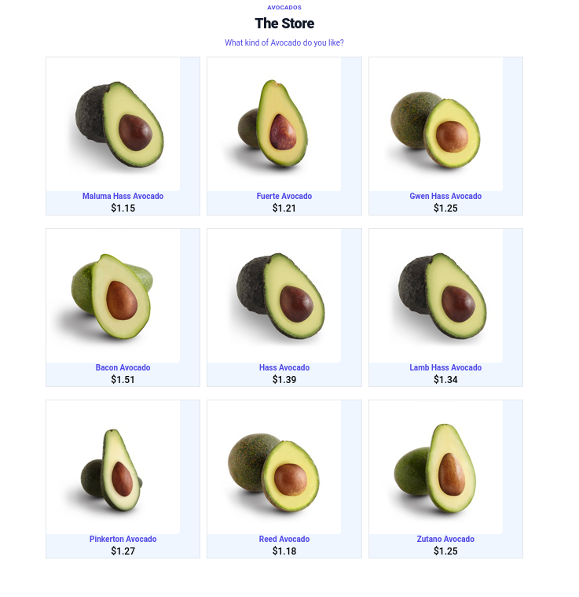

<h3>Hello Visitor!!</h3>

# Project: API fetch workshop

## Website:

- [click here]()

<kbd>
 
</kbd> -->
 

## Description:

-A single page api fetch

-api : https://platzi-avo.vercel.app/api/avo

-Using the browser internationalization API

-Usando https://tailwindcss.com

## FullDescription:

-first we look for the fruit api
then with fetch we query the data, process it and render it with tailwindcss

## Author:

- RM