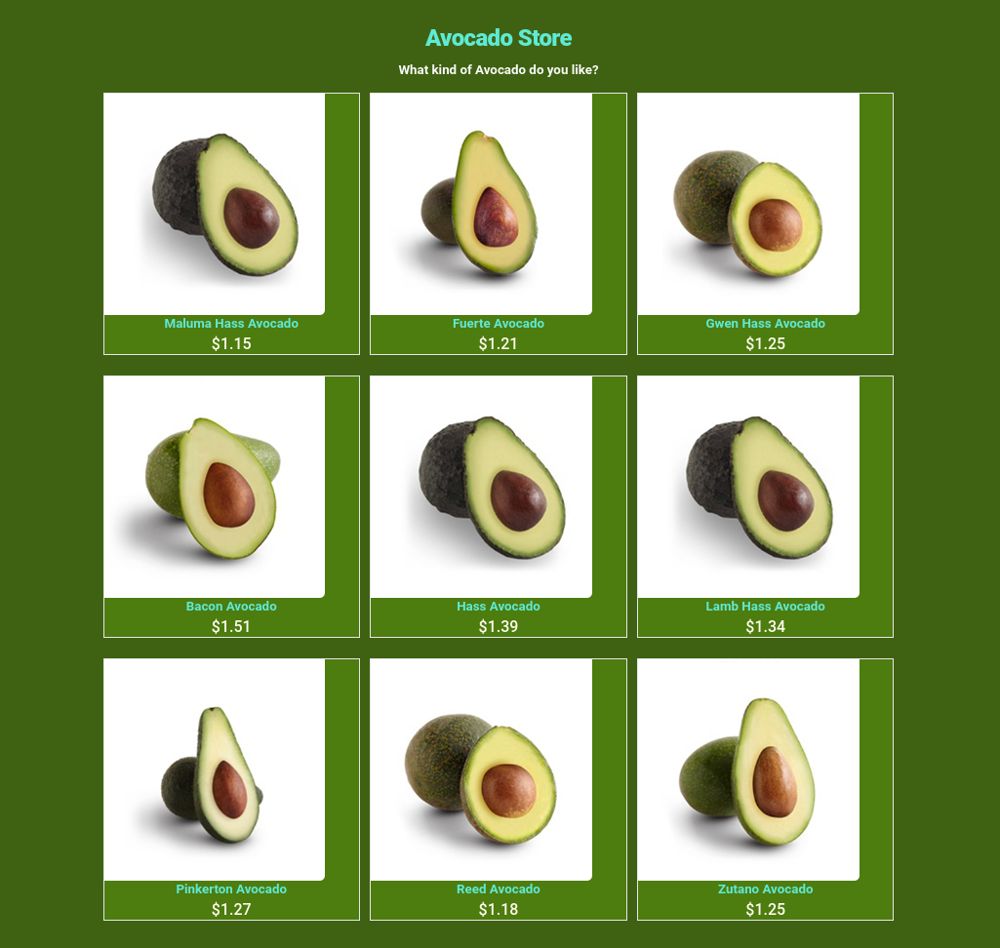

<h3>Hello Visitor!!</h3>

# Project: API fetch workshop

## Website:

- [click here](https://roddevwork.github.io/workshop-1-fetch-avocado/index.html)

<kbd>
 
</kbd> 
 

## Description:

-A single page api fetch with responsive website design

-api : https://platzi-avo.vercel.app/api/avo

-Using the browser internationalization API

-Using https://tailwindcss.com

## FullDescription:

-first: we look for the avocado api
-second: With fetch we query the data, 
-third: We process data
-fourth:  we use tailwindcss to styles
-fifth: we render the page with npm

## Author:

- RM
